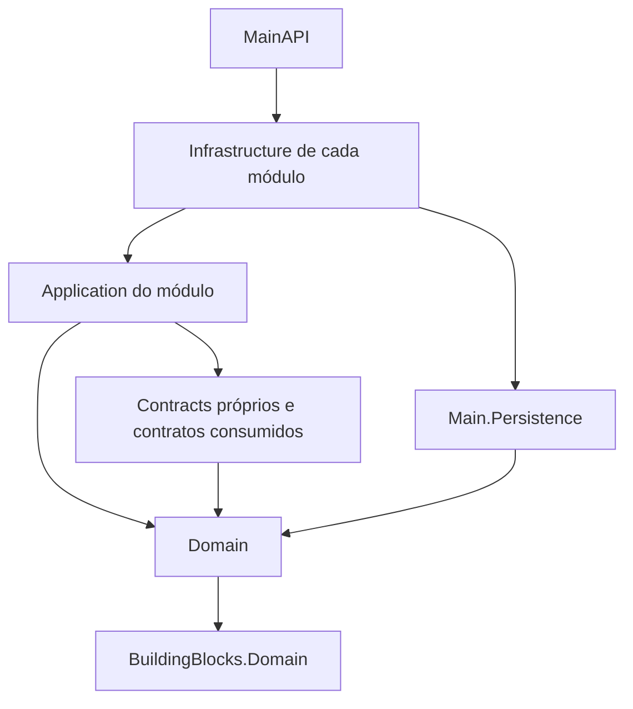

# MainDDD estrutura geral

Estrutura implementada na branch `refactor/modular-monolith`, em 08/09/2026. Esta revisão acompanha a modularização; sua disponibilidade em DEV depende da integração da [PR #106](https://github.com/JAyres88/MainDDD/pull/106).

## Visão geral

O MainDDD continua sendo um monólito modular: uma API, uma solução .NET e um contexto de banco compartilhado. Cada módulo agora possui DLLs próprias. As referências de projeto controlam as dependências durante a compilação; a comunicação continua em memória, dentro do mesmo processo.

```text
MainDDD/
├── Main.sln
├── src/
│   ├── BuildingBlocks/
│   │   ├── Domain/
│   │   └── Application/
│   ├── Core/
│   │   ├── Application/
│   │   ├── Domain/
│   │   └── Utilities/
│   ├── Persistence/
│   │   ├── Context/
│   │   ├── Migrations/
│   │   ├── Modules/
│   │   ├── Queries/
│   │   ├── Repositories/
│   │   ├── Services/
│   │   ├── Specifications/
│   │   └── Time/
│   ├── Modules/
│   │   ├── Catalogo/
│   │   ├── Pessoas/
│   │   ├── Precificacao/
│   │   ├── Documentos/
│   │   ├── Estoque/
│   │   ├── IdentidadeAcesso/
│   │   └── Administracao/
│   └── MainAPI/
├── Frontend/Main/
│   ├── Main/
│   └── Main.Client/
└── Tests/
    ├── MainAPI.UnitTests/
    └── MainAPI.ContractTests/
```

## Estrutura de cada módulo

```text
Modules/Documentos/
├── Domain/Main.Documentos.Domain.csproj
├── Contracts/Main.Documentos.Contracts.csproj
├── Application/Main.Documentos.Application.csproj
├── Infrastructure/Main.Documentos.Infrastructure.csproj
└── Presentation/DocumentoController.cs
```

Os sete módulos seguem esse padrão. Cada `.csproj` compila seus próprios arquivos. Os controllers de Presentation são a exceção deliberada: continuam compilados pelo MainAPI.

| Pasta | Responsabilidade | Exemplos |
| --- | --- | --- |
| Domain | Entidades, agregados, eventos, políticas e contratos de repositório. | Documento, DocumentoItem, PoliticaComercialDocumento. |
| Contracts | Contratos públicos e DTOs utilizados por outros módulos ou pela apresentação. | DocumentoCreateDTO, IDocumentoCommandService. |
| Application | Casos de uso, mensagens, handlers, validação e mapeamentos. | CriarDocumentoHandler, DocumentoCommandService, DocumentoCreateDTOValidator. |
| Infrastructure | Repositórios, consultas, serviços concretos e registro do módulo. | DocumentoRepository, DocumentoQueryService, DocumentosModule. |
| Presentation | Endpoints HTTP. | DocumentoController. |

Contracts foi separado para permitir que um módulo consuma operações de outro sem referenciar sua implementação Application. Os namespaces existentes foram preservados: um tipo em uma nova pasta pode continuar com namespace `MainAPI.Core.*`; seu assembly e sua responsabilidade agora pertencem ao módulo.

## Responsabilidade dos módulos

| Módulo | Responsabilidade |
| --- | --- |
| Catálogo | Produtos, categorias, embalagens e associações. |
| Pessoas | Pessoas, endereços e seus vínculos. |
| Precificação | Tabelas e preços por apresentação de produto. |
| Documentos | Documentos, itens, tipos, versões, numeração, saldos documentais e cadastros de locais/tipos de saldo. |
| Estoque | Saldos e movimentação de estoque, incluindo integração com documentos. |
| IdentidadeAcesso | Usuários, tenants, contexto de execução, autenticação e autorização. |
| Administração | Auditoria, identidade visual, importação e outbox. |

## Fundamentos e Core

`BuildingBlocks/Domain` contém Entity, AggregateRoot, Guard, contratos de eventos e tipos compartilhados em `Shared`, como objetos de valor e bases de especificação. `BuildingBlocks/Application` contém mensagens, resultados e paginação.

`Core/Application` agora mantém abstrações comuns, exceções, parâmetros básicos e `ModuleApplicationRegistration`. O registro recebe explicitamente o assembly Application de cada módulo para descobrir seus handlers e mapeamentos. DTOs, validadores e perfis específicos saíram do Core e foram para seus módulos.

`Core/Utilities` contém utilitários ainda compilados por MainAPI.Application.

`Core/Domain` mantém somente uma fachada de compatibilidade com o nome `MainAPI.Domain`. Ela redireciona os tipos de eventos para as novas DLLs, permitindo que mensagens já gravadas na outbox com o nome antigo continuem sendo desserializadas. Não é mais o assembly que compila todos os domínios.

## Persistência compartilhada

`Main.Persistence` concentra o contexto, o modelo e a evolução do banco.

| Pasta | Conteúdo |
| --- | --- |
| Context | AppDbContext e interceptor de consultas. |
| Modules/NomeDoModulo/Configurations | Mapeamentos EF das entidades de cada módulo. |
| Modules/NomeDoModulo/Seeds | Dados iniciais existentes de cada módulo. |
| Migrations | Migrations históricas e snapshot do modelo. |
| Repositories / Queries / Specifications | Bases compartilhadas de acesso e consulta. |
| Services | EfTransactionService. |
| Time | Implementação SystemClock. |

Os repositórios das bibliotecas Infrastructure utilizam o mesmo AppDbContext scoped. IUnitOfWork resolve essa mesma instância, preservando transações entre documentos e estoque. Não foram criados bancos por módulo.

Main.Persistence referencia os domínios necessários ao modelo, mas não depende das implementações Infrastructure. As configurações foram centralizadas aqui para evitar uma referência circular durante a extração.

## MainAPI e composição

MainAPI continua contendo Program, pipeline HTTP, configuração do banco, logging, Swagger, tratamento de exceções e o despachante CqrsSender. Seus ProjectReference incluem as bibliotecas Infrastructure dos módulos.

ApplicationService chama AddCatalogoModule, AddPessoasModule e as demais entradas. Cada módulo registra suas implementações e usa seu próprio assembly Application para registrar handlers e perfis AutoMapper. A inicialização não depende de procurar arquivos nem de carregar plugins dinamicamente.



O diagrama resume as direções principais; nem todo Contracts precisa referenciar diretamente Domain. Algumas referências entre domínios permanecem, como Documentos para Pessoas e Precificação e Estoque para Documentos. A extração estabelece limites de compilação, mas não elimina automaticamente todo acoplamento funcional.

## Frontend

Frontend/Main/Main hospeda a interface Blazor, componentes Razor e o proxy `/api/{**path}` para o endereço de backend configurado em ApiBaseUrl. Main.Client executa a interface WebAssembly com Fluent UI.

| Pasta do cliente | Uso |
| --- | --- |
| Pages | Telas de cadastro, documentos, estoque e administração. |
| Components | Grids, formulários, pesquisas e modais reutilizáveis. |
| Layout | Navegação e estrutura visual. |
| Services | MainApiClient, AuthSession, BrandingState e tratamento de concorrência. |
| Models | Modelos próprios da interface. |

Os projetos frontend continuam independentes dos assemblies de domínio e se comunicam por HTTP. A API mantém a autenticação atual exclusiva de Development; a modularização não habilita autenticação de produção.

## Testes e ferramentas

MainAPI.UnitTests cobre regras de domínio, componentes e limites de dependência das 28 bibliotecas dos módulos. Inclui a compatibilidade dos nomes históricos de eventos. MainAPI.ContractTests cobre contratos HTTP, resolução dos handlers de todos os módulos, compartilhamento do Unit of Work e geração do script de migrations SQL Server sem conexão.

Os testes HTTP usam EF InMemory; eles não substituem todas as verificações de execução em SQL Server. A verificação de migrations confirmou que o modelo não exige mudanças de esquema após a extração.

`.git` guarda os metadados do repositório; `.config` e `.codex` contêm configurações de ferramentas; `.vs`, `bin` e `obj` são dados locais/gerados. Essas pastas não são camadas de negócio.

## Como executar

Na raiz do MainDDD:

```shell
dotnet build Main.sln
dotnet test Main.sln
dotnet run --project src/MainAPI/MainAPI.csproj
dotnet run --project Frontend/Main/Main/Main.csproj
dotnet publish src/MainAPI/MainAPI.csproj -c Release
```

O pacote do MainAPI contém as DLLs necessárias. A publicação continua única.

## Migrations

Com o ambiente Development configurado para o host atual:

```shell
dotnet ef migrations has-pending-model-changes --project src/Persistence --startup-project src/MainAPI
dotnet ef migrations add NomeDaAlteracao --project src/Persistence --startup-project src/MainAPI --output-dir Migrations
dotnet ef database update --project src/Persistence --startup-project src/MainAPI
```

O último comando aplica alterações ao banco configurado. A extração em si não requer migration nova.

## Onde fazer alterações

- Regra de negócio: Domain do módulo.
- Contrato ou DTO público: Contracts do módulo.
- Caso de uso, validação ou mapeamento: Application do módulo.
- Repositório, consulta ou serviço concreto: Infrastructure do módulo.
- Endpoint: Presentation do módulo.
- Mapeamento de tabela: Persistence/Modules correspondente.
- Evolução do esquema: Persistence/Migrations.
- Tela ou componente: Main.Client.
- Documentação: MainDocs.

Consulte também o [caminho de leitura e escrita](caminho-requisicoes-leitura-escrita.md).
