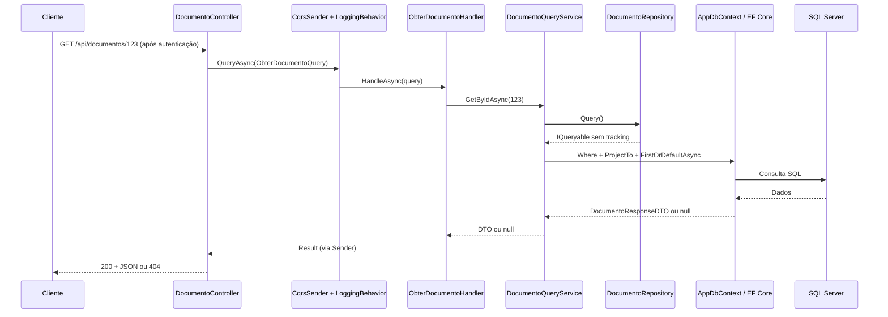
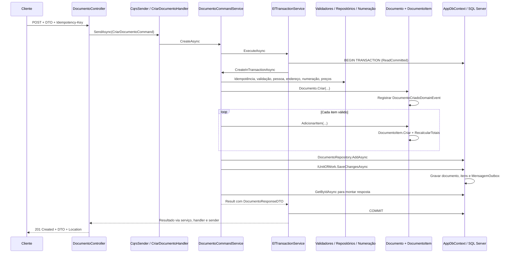

# Caminho de uma requisição: leitura e escrita com agregado

Este guia acompanha duas operações reais do MainDDD: consultar um documento por ID e criar um documento com itens. Explica a sequência de chamadas, as responsabilidades das classes e as tecnologias que participam de cada etapa.

Base: código local do MainDDD, atualizado em 08/09/2026 para a branch `refactor/modular-monolith`. Os fluxos funcionais foram preservados na extração das DLLs; a integração na branch principal depende da PR correspondente. Os links de código pressupõem que MainDocs e MainDDD estão em pastas irmãs.

## 1. Visão geral

Uma requisição chega pela API HTTP, passa pela autenticação e autorização e é encaminhada a um controller. O controller transforma a intenção do cliente em uma mensagem de aplicação. O despachante encontra o handler responsável. A partir daí, leitura e escrita seguem caminhos diferentes.

| Conceito | Papel neste projeto |
| --- | --- |
| Controller | Receber HTTP e escolher o status e o corpo da resposta. |
| DTO | Transportar dados de entrada ou saída, sem executar a operação de negócio. |
| Query / Command | Representar, respectivamente, a intenção de consultar ou alterar dados. |
| Handler | Receber a mensagem despachada e encaminhar o caso de uso. |
| Query service | Montar a consulta e projetar os dados para o DTO de resposta. |
| Command service | Coordenar validação, consultas auxiliares, agregado e persistência. |
| Agregado | Grupo de objetos de domínio cujas alterações são coordenadas pela raiz. |
| Repository | Expor consultas e operações de persistência das entidades. |
| Unit of Work | Gravar as alterações acompanhadas pelo contexto de persistência. |

Aqui, **agregação significa um agregado DDD**: `Documento` é a raiz, com `DocumentoItem` e saldos documentais sob sua coordenação. O cálculo dos totais é uma das regras desse agregado, mas não é o significado completo do termo.

A separação CQRS é feita dentro da mesma aplicação e usa o mesmo `AppDbContext` e banco. Não há exigência de bancos separados para leitura e escrita. Cada módulo possui DLLs Domain, Contracts, Application e Infrastructure. `MainAPI.csproj` referencia suas bibliotecas e compila os controllers de Presentation. O conjunto continua sendo uma única aplicação.

## 2. Entrada comum aos dois caminhos

1. **Configuração na inicialização:** `Program` chama `ApplicationService.AddMainApplication()`, `DatabaseService.ConfigureDatabase()` e `AuthenticationService.ConfigureAuthentication()`. ApplicationService chama as entradas Add<Modulo>Module, que registram implementações, validadores e descobrem handlers e mapeamentos no assembly Application de cada módulo. O host registra os controllers e a infraestrutura comum.
2. **Recebimento HTTP:** o pipeline contém `ExceptionHandlingMiddleware`, um middleware que preenche `HttpContext.Items["HoraGlobal"]`, roteamento, CORS em Development, autenticação e autorização. Os controllers são expostos por `MapControllers()`.
3. **Identificação do usuário:** `DevAuthenticationHandler` consulta usuário e tenant ativos e constrói suas claims. A configuração atual aceita somente Development; fora desse ambiente, a inicialização lança exceção informando que Microsoft Entra ainda não foi configurado.
4. **Permissão:** a política do endpoint é avaliada por `PermissaoAuthorizationHandler`. Ler exige `Permissoes.DocumentosLer`; criar exige `Permissoes.DocumentosCriar`. Uma requisição pode terminar antes de chegar ao controller por falta de autenticação ou permissão.
5. **Binding:** ASP.NET Core transforma rota, cabeçalhos e JSON nos parâmetros da action. Os controllers estão configurados com Newtonsoft.Json.
6. **Despacho:** o controller usa `ISender`, implementado por `CqrsSender`. Esse componente resolve o handler pela injeção de dependência e envolve a execução nos behaviors registrados. Atualmente, `LoggingBehavior<TMessage, TResult>` registra o início e a duração da mensagem.

`CqrsSender` é implementação do próprio projeto, não MediatR. A validação de criação ocorre explicitamente no serviço de comando; não há um behavior de validação registrado nesse caminho. `CancellationToken` é repassado pelas chamadas do fluxo principal.

## 3. Leitura: consultar um documento

Exemplo: `GET /api/documentos/123`, com um usuário autorizado. O ID é ilustrativo e precisa existir no banco para a resposta ser 200.



### Passo a passo e classes

| Etapa | Classe / método | O que acontece |
| --- | --- | --- |
| 1 | `DocumentoController.GetDocumentoById` | Recebe `id` e cria `ObterDocumentoQuery(id)`. |
| 2 | `CqrsSender.QueryAsync` | Localiza `IQueryHandler<ObterDocumentoQuery, Result<DocumentoResponseDTO>>`, passando pelo logging. |
| 3 | `ObterDocumentoHandler.HandleAsync` | Rejeita ID menor ou igual a zero; chama `IDocumentoQueryService.GetByIdAsync`. |
| 4 | `DocumentoQueryService.GetByIdAsync` | Obtém a consulta do repositório, filtra pelo ID e aplica `ProjectTo<DocumentoResponseDTO>`. |
| 5 | `DocumentoRepository.Query` | Retorna `_context.Documentos.AsNoTracking()`. A leitura não mantém essas entidades no rastreamento de alterações. |
| 6 | `DocumentoMappingProfile` | Define como os dados do documento e dos itens entram nos DTOs, incluindo nomes e versão do tipo documental. |
| 7 | `AppDbContext` e EF Core | Executam a expressão ao chegar em `FirstOrDefaultAsync`, usando o provedor SQL Server. |
| 8 | Handler e controller | O handler produz `Result.Ok` ou `Result.Fail`. O controller devolve o DTO com 200 ou a mensagem com 404. |

`ProjectTo` monta uma projeção LINQ para o EF Core consultar os dados necessários ao DTO. Esse caminho não chama `Documento.Criar`, `AdicionarItem` ou `SaveChangesAsync`, nem carrega o agregado para executar suas operações de escrita. O tipo `Documento` ainda participa como modelo de consulta do EF.

O wrapper `Result<T>` é usado internamente; no sucesso, o corpo HTTP é `result.Data`, não o wrapper completo. No código atual, um ID numérico inválido, como zero, também termina em 404 nessa action porque toda falha do handler é convertida em `NotFound`.

### E se a leitura for uma lista?

`GET /api/documentos` usa `DocumentoController.GetAll` → `ListarDocumentosQuery` → `ListarDocumentosHandler` → `DocumentoQueryService.QueryAsync`. Nesse caminho entram `DocumentoQueryParams`, `DocumentoSpecification` e `QueryServiceBase`, que trata a consulta paginada com apoio do avaliador de especificações. A consulta por ID apresentada acima não passa por essa especificação.

## 4. Escrita: criar um documento com itens

Exemplo de corpo para `POST /api/documentos`, acompanhado de `Content-Type: application/json` e `Idempotency-Key: exemplo-documento-001`:

```json
{
  "pessoaId": 1,
  "enderecoEntregaId": 1,
  "dataProcessamento": "2026-09-08T12:00:00Z",
  "dataPrevisaoNecessidade": "2026-09-09T12:00:00Z",
  "tipoDocumentoId": 1,
  "produtos": [
    {
      "produtoId": 1,
      "embalagemId": 1,
      "tabelaPrecoId": 1,
      "quantidade": 2,
      "desconto": 0
    }
  ]
}
```

Os IDs são ilustrativos. Use cadastros válidos, datas compatíveis com o dia da execução e os locais/tipos de saldo exigidos pelo tipo de documento. O cliente informa a referência da tabela de preço; o preço unitário é obtido pelo servidor.



O diagrama mostra a criação bem-sucedida de um novo documento. A repetição de uma chave já gravada segue o desvio de idempotência descrito adiante.

### Passo a passo e classes

1. **Entrada — `DocumentoController.Create`:** recebe `DocumentoCreateDTO`, composto por uma coleção de `DocumentoItemCreateDTO`. Exige `Idempotency-Key` não vazio e com até 100 caracteres. Remove espaços nas extremidades da chave e envia `CriarDocumentoCommand` por `ISender.SendAsync`.
2. **Encaminhamento — `CriarDocumentoHandler`:** chama `IDocumentoCommandService.CreateAsync`, implementado por `DocumentoCommandService`. O handler é pequeno: a coordenação dessa operação permanece no serviço.
3. **Identificação do conteúdo — `DocumentoCommandService.ComputeRequestHash`:** serializa o DTO com System.Text.Json e calcula SHA-256. O hash permite comparar o conteúdo de chamadas que reutilizam a mesma chave.
4. **Transação — `EfTransactionService.ExecuteAsync`:** usa a estratégia de execução do EF e abre uma transação `ReadCommitted`. Executa `CreateInTransactionAsync` e faz commit quando a função retorna normalmente; em exceções, faz rollback.
5. **Idempotência — `DocumentoRepository.GetByIdempotencyKeyAsync`:** procura um documento anterior antes de validar e criar outro. Mesmo hash retorna o documento existente; hash diferente lança `IdempotencyConflictException`.
6. **Validação de entrada — `DocumentoCreateDTOValidator` e `DocumentoItemCreateDTOValidator`:** verificam campos, datas, existência de itens e duplicidade de produto/apresentação, entre outras regras de entrada. `PessoaRepository`, `PessoaEnderecoRepository` ou `EnderecoRepository` verificam a pessoa e o endereço informado.
7. **Numeração — `NumeracaoDocumentoService.ReservarAsync`:** consulta `TipoDocumento` e sua versão vigente, usa `NumeradorDocumento.ReservarProximo()` e monta o identificador. Quando não existe versão vigente, publica uma e chama `SaveChangesAsync` dentro da mesma transação. O tipo padrão é 1 quando o DTO não o informa.
8. **Dimensões — `DocumentoCommandService.ResolverDimensoesAsync`:** resolve origem, destino e tipos de saldo conforme a operação e as permissões do tipo documental. Usa `EstoqueCadastroRepository` para conferir associações entre local e tipo de saldo.
9. **Raiz — `Documento.Criar`:** valida invariantes do cabeçalho, normaliza datas, define o status `Aberto` e registra `DocumentoCriadoDomainEvent` em memória.
10. **Itens — `ProdutoPrecoRepository` e `PoliticaComercialDocumento.ValidarItem`:** obtêm preço e dados relacionados, validam vigência e regras de venda ou compra. Para cada item, o serviço chama `documento.AdicionarItem(...)`.
11. **Regras do agregado — `Documento` e `DocumentoItem`:** a raiz exige documento aberto e impede apresentação duplicada. `DocumentoItem.Criar` valida quantidade, fator de conversão, preço por meio de `Preco.Criar` e desconto. A raiz recalcula os totais após adicionar o item.
12. **Persistência — `DocumentoRepository.AddAsync` e `AppDbContext.SaveChangesAsync`:** `AddAsync` adiciona o agregado ao contexto; a gravação acontece no `SaveChangesAsync` exposto por `IUnitOfWork`. O contexto transforma os eventos pendentes em `MensagemOutbox` e grava as alterações. Após sucesso, limpa os eventos em memória.
13. **Resposta — `DocumentoCommandService.GetByIdAsync`:** consulta o documento pelo repositório com relacionamentos e aplica `_mapper.Map<DocumentoResponseDTO>`. Essa montagem da resposta da escrita é diferente do `ProjectTo` usado pelo GET. A consulta acontece antes do commit externo; a resposta HTTP só é devolvida depois que a transação retorna.
14. **HTTP — `DocumentoController.Create`:** retorna `CreatedAtRoute`, com status 201, DTO e `Location` apontando para a rota de consulta por ID.

### O que o agregado protege?

O serviço de aplicação coordena os recursos necessários; a raiz executa as alterações de negócio. No caminho atual, os itens são criados por `Documento.AdicionarItem`, que chama a fábrica interna de `DocumentoItem` e atualiza os totais.

Exemplo: para quantidade 2, preço unitário 50 e desconto 5, o item calcula bruto 100 e total 95. O desconto nesse cálculo é um valor monetário do item. A raiz soma os valores dos itens para definir `ValorBruto`, `ValorDesconto` e `ValorTotal`.

Pessoa, produto e tabela de preço são referências consultadas durante a operação; não se tornam partes do agregado apenas por aparecerem em propriedades de navegação. Cabe ao agregado documental coordenar seu cabeçalho, itens e operações de saldo. As coleções `DocumentoItens` e `Saldos` ainda são expostas como `ICollection`: o fluxo descrito usa os métodos de domínio, embora o encapsulamento das coleções não seja completo.

### Idempotência, transação e falhas

- **Mesma chave e mesmo conteúdo:** retorna o documento existente. A action atual também responde 201 nesse caso, pois usa a mesma saída de sucesso.
- **Mesma chave e conteúdo diferente:** lança `IdempotencyConflictException`, convertida em 409 pelo middleware.
- **Concorrência na criação:** há índice único para `IdempotencyKey`. O serviço captura `PersistenceWriteException` e tenta localizar o documento que a outra requisição persistiu para resolver a repetição.
- **Falha de validação retornada como `Result.Fail`:** o controller responde 400. Atenção ao comportamento real: `EfTransactionService` não inspeciona `Result.Success`; qualquer retorno normal leva a commit. Não se deve afirmar que todo resultado de falha causa rollback. Isso é relevante porque a publicação de versão do tipo pode salvar antes de uma falha posterior retornada pelo serviço.
- **Exceção de domínio:** `DomainException` é tratada pelo middleware como 422. Exceções provocam rollback no serviço transacional.
- **Falhas inesperadas:** seguem para o tratamento global e podem resultar em 500. `ErrorResponse` e o cabeçalho `X-Trace-Id` são usados no caminho de exceções; as falhas retornadas diretamente pelo controller não passam por essa formatação.

### Eventos após a gravação

`DocumentoCriadoDomainEvent` é registrado pela raiz e convertido em uma linha de outbox pelo contexto. Documento e mensagem são persistidos na transação; isso não significa que todos os consumidores do evento concluíram antes da resposta HTTP.

`OutboxBackgroundService` aciona `OutboxProcessor`, que reserva mensagens, desserializa seus eventos e os entrega a `DomainEventDispatcher`. Para criação de documento, `AuditoriaDomainEventHandler` está registrado. O processamento tem controle de tentativas e ocorre separadamente da requisição. Nesse fluxo, a outbox usa o banco da aplicação, sem exigir um broker externo.

### Criar e processar são operações diferentes

O POST cria o documento **aberto**. Informar `DataProcessamento` não executa automaticamente a operação de processamento.

`PATCH /api/documentos/{id}/processamento` segue por `ProcessarDocumentoCommand` → `ProcessarDocumentoHandler` → `DocumentoCommandService.ProcessarAsync`. Esse caminho carrega o agregado, usa `RowVersion`, chama `Documento.Processar` e pode criar `SaldoDocumentoItem`. Também chama `EstoqueDocumentoService.MovimentarConfiguradoAsync` para os itens, conforme a configuração, e grava as mudanças. O evento correspondente é `DocumentoProcessadoDomainEvent`.

## 5. Tecnologias e padrões presentes

As versões abaixo são as declaradas em `MainAPI.csproj` na revisão consultada, não uma recomendação de atualização.

| Tecnologia / padrão | Uso concreto |
| --- | --- |
| C# / .NET 8 (`net8.0`) e ASP.NET Core | API HTTP, controllers, middleware, autorização e execução assíncrona. |
| Injeção de dependência do .NET | Resolve `ISender`, handlers, serviços, repositórios e o contexto; `IUnitOfWork` aponta para o mesmo `AppDbContext` scoped. |
| CQRS próprio | `IQuery`, `ICommand`, handlers e `CqrsSender` separam intenções de leitura e escrita. |
| DDD | `AggregateRoot<int>`, `Documento`, `DocumentoItem`, `Preco`, políticas, guards e eventos de domínio. |
| Entity Framework Core 9.0.9 | LINQ, projeção, rastreamento, persistência de relacionamentos e transações. |
| SQL Server / provedor EF 9.0.9 | Banco configurado em `DatabaseService`; índices únicos, constraints e versões de concorrência. |
| AutoMapper (integração DI 12.0.0) | `ProjectTo` na consulta por ID e `Map` na resposta da criação. |
| FluentValidation (integração ASP.NET Core 11.3.0) | Validadores de DTO chamados explicitamente pelo serviço de comando. |
| Newtonsoft.Json 13.0.3 | Configurado para JSON dos controllers. |
| System.Text.Json e SHA-256 | Serialização do DTO para hash de idempotência e serialização de eventos da outbox. |
| Serilog / `ILogger` | Logs da aplicação e da execução de mensagens por `LoggingBehavior`. |
| Swashbuckle 9.0.5 | Swagger/OpenAPI e interface de exploração da API em Development. |
| Autenticação local de desenvolvimento | `DevAuthenticationHandler` e autorização por políticas; os pacotes JWT/Entra presentes não representam autenticação de produção já configurada. |
| Transactional Outbox / BackgroundService | Persiste eventos junto com alterações e executa consumidores posteriormente. |

## 6. Comparação dos dois caminhos

| Aspecto | GET por ID | POST de criação |
| --- | --- | --- |
| Mensagem | `ObterDocumentoQuery` | `CriarDocumentoCommand` |
| Handler | `ObterDocumentoHandler` | `CriarDocumentoHandler` |
| Serviço principal | `DocumentoQueryService` | `DocumentoCommandService` |
| Uso do domínio | Modelo para projeção de dados | Fábrica e métodos do agregado executam regras |
| Acesso a dados | `Query`, `AsNoTracking`, `ProjectTo` | Consultas auxiliares, `AddAsync`, `SaveChangesAsync` |
| Transação explícita de aplicação | Não passa por `EfTransactionService` | `ReadCommitted` por `EfTransactionService` |
| Evento de criação / outbox | Não gera | `DocumentoCriadoDomainEvent` / `MensagemOutbox` |
| Resposta de sucesso | 200 com DTO | 201 com DTO e Location |

## 7. Código de referência

### Entrada e infraestrutura compartilhada

- [Program.cs](https://github.com/JAyres88/MainDDD/blob/7c94cd3/src/MainAPI/Program.cs)
- [ApplicationService.cs — registros de dependência](https://github.com/JAyres88/MainDDD/blob/7c94cd3/src/MainAPI/Infrastructure/Shared/Services/ApplicationService.cs)
- [CqrsSender.cs](https://github.com/JAyres88/MainDDD/blob/7c94cd3/src/MainAPI/Infrastructure/Shared/Services/CqrsSender.cs)
- [LoggingBehavior.cs](https://github.com/JAyres88/MainDDD/blob/7c94cd3/src/MainAPI/Infrastructure/Shared/Services/LoggingBehavior.cs)
- [AuthenticationService.cs](https://github.com/JAyres88/MainDDD/blob/7c94cd3/src/Modules/IdentidadeAcesso/Infrastructure/Services/AuthenticationService.cs)
- [DevAuthenticationHandler.cs](https://github.com/JAyres88/MainDDD/blob/7c94cd3/src/Modules/IdentidadeAcesso/Infrastructure/Security/DevAuthenticationHandler.cs)
- [ExceptionHandlingMiddleware.cs](https://github.com/JAyres88/MainDDD/blob/7c94cd3/src/MainAPI/Infrastructure/Shared/Services/ExceptionHandlingMiddleware.cs)
- [MainAPI.csproj — tecnologias e composição](https://github.com/JAyres88/MainDDD/blob/7c94cd3/src/MainAPI/MainAPI.csproj)

### Leitura e escrita

- [DocumentoController.cs](https://github.com/JAyres88/MainDDD/blob/7c94cd3/src/Modules/Documentos/Presentation/DocumentoController.cs)
- [DocumentoReadMessages.cs — queries e handlers](https://github.com/JAyres88/MainDDD/blob/7c94cd3/src/Modules/Documentos/Application/Documentos/DocumentoReadMessages.cs)
- [DocumentoQueryService.cs](https://github.com/JAyres88/MainDDD/blob/7c94cd3/src/Modules/Documentos/Infrastructure/Queries/DocumentoQueryService.cs)
- [DocumentoMappingProfile.cs](https://github.com/JAyres88/MainDDD/blob/7c94cd3/src/Modules/Documentos/Application/Mappings/DocumentoMappingProfile.cs)
- [DocumentoWriteMessages.cs — commands e handlers](https://github.com/JAyres88/MainDDD/blob/7c94cd3/src/Modules/Documentos/Application/Documentos/DocumentoWriteMessages.cs)
- [DocumentoCommandService.cs](https://github.com/JAyres88/MainDDD/blob/7c94cd3/src/Modules/Documentos/Application/Documentos/DocumentoCommandService.cs)
- [DocumentoCreateDTO.cs](https://github.com/JAyres88/MainDDD/blob/7c94cd3/src/Modules/Documentos/Contracts/DTOs/Requests/DocumentoCreateDTO.cs)
- [DocumentoCreateDTOValidator.cs](https://github.com/JAyres88/MainDDD/blob/7c94cd3/src/Modules/Documentos/Application/Validators/DocumentoCreateDTOValidator.cs)
- [NumeracaoDocumentoService.cs](https://github.com/JAyres88/MainDDD/blob/7c94cd3/src/Modules/Documentos/Infrastructure/Services/NumeracaoDocumentoService.cs)
- [Documento.cs — raiz do agregado](https://github.com/JAyres88/MainDDD/blob/7c94cd3/src/Modules/Documentos/Domain/Entities/Documento.cs)
- [DocumentoItem.cs](https://github.com/JAyres88/MainDDD/blob/7c94cd3/src/Modules/Documentos/Domain/Entities/DocumentoItem.cs)
- [PoliticaComercialDocumento.cs](https://github.com/JAyres88/MainDDD/blob/7c94cd3/src/Modules/Documentos/Domain/Services/PoliticaComercialDocumento.cs)

### Persistência e eventos

O contexto e as migrations pertencem a `Main.Persistence`. A DLL `MainAPI.Domain` mantém redirecionamento dos tipos de eventos antigos, preservando a leitura das mensagens já persistidas na outbox.


- [DocumentoRepository.cs](https://github.com/JAyres88/MainDDD/blob/7c94cd3/src/Modules/Documentos/Infrastructure/Repositories/DocumentoRepository.cs)
- [EfTransactionService.cs](https://github.com/JAyres88/MainDDD/blob/7c94cd3/src/Persistence/Services/EfTransactionService.cs)
- [AppDbContext.cs](https://github.com/JAyres88/MainDDD/blob/7c94cd3/src/Persistence/Context/AppDbContext.cs)
- [DocumentoTableConfiguration.cs](https://github.com/JAyres88/MainDDD/blob/7c94cd3/src/Persistence/Modules/Documentos/Configurations/DocumentoTableConfiguration.cs)
- [OutboxProcessor.cs](https://github.com/JAyres88/MainDDD/blob/7c94cd3/src/Modules/Administracao/Infrastructure/Services/OutboxProcessor.cs)

A documentação foi conferida por leitura do código. Não foram executadas requisições nem alterações no banco para produzir este guia.
