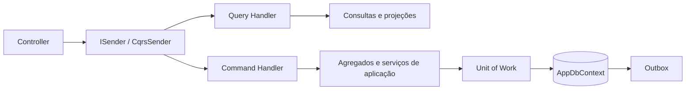

# Fundação DDD e CQRS

## Objetivo

O MainDDD é um monólito modular em .NET. Ele combina DDD para proteger regras de negócio com CQRS para separar comandos e consultas dentro de cada módulo.

CQRS não cria dois bancos nem dois sistemas. O MainDDD continua com uma API, um `AppDbContext`, uma unidade de trabalho e migrations compartilhadas. A separação ocorre no código: escrita passa por comandos e leitura passa por consultas.



## Organização modular

Cada módulo possui projetos próprios:

```text
Modules/NomeDoModulo/
├── Domain/          regras, agregados, eventos e contratos de repositório
├── Contracts/       DTOs e interfaces públicas do módulo
├── Application/     comandos, consultas, handlers e validações
├── Infrastructure/  persistência, consultas, repositórios e registro do módulo
└── Presentation/    controllers compilados pelo host MainAPI
```

`Domain` não referencia ASP.NET, Entity Framework ou infraestrutura. `Application` referencia domínio, contratos e fundamentos compartilhados, sem depender de implementações de infraestrutura. `Infrastructure` implementa os contratos e usa a persistência compartilhada. O host `MainAPI` reúne os módulos, autenticação, Swagger e a fronteira HTTP.

Os módulos atuais são Catálogo, Pessoas, Precificação, Documentos, Estoque, Identidade e Acesso e Administração.

## Modelo de domínio

- `Entity<TId>` define identidade e igualdade por tipo e identificador.
- `AggregateRoot<TId>` concentra invariantes e coleta eventos de domínio.
- `Guard`, `DomainError` e `DomainException` tornam explícitas as regras inválidas.
- Repositórios são contratos do domínio; suas implementações pertencem à infraestrutura.
- DTOs e contratos HTTP não são entidades de domínio.

Um agregado preserva a consistência da alteração antes que ela seja persistida. A aplicação coordena o agregado, validações, repositórios e serviços externos.

## CQRS aplicado

### Consultas

Uma consulta implementa `IQuery<TResult>` e tem um único `IQueryHandler<TQuery, TResult>`. Ela não altera estado. Handlers de consulta usam serviços de query ou projeções para retornar o modelo necessário à API.

Exemplo: `ListarDocumentosQuery` é entregue ao handler de leitura, que usa `IDocumentoQueryService` e retorna a paginação de documentos.

### Comandos

Um comando implementa `ICommand<TResult>` e tem um único `ICommandHandler<TCommand, TResult>`. Ele representa uma intenção de mudança, como criar, atualizar, processar ou cancelar um documento.

O handler aplica validações e regras de negócio, altera agregados ou delega a uma orquestração de domínio existente e confirma a operação pela unidade de trabalho. Controllers não chamam repositórios ou serviços de domínio diretamente.

### Dispatcher e pipeline

`ISender` é o ponto único usado pelos controllers. `CqrsSender` resolve o handler correto e executa os `IPipelineBehavior` registrados. O comportamento atual registra início, conclusão e duração de cada mensagem CQRS.

Cada módulo chama `AddModuleApplication`, que descobre seus handlers e perfis AutoMapper no assembly `Application`. O host registra os módulos por `Add<Modulo>Module()`.

## Persistência, transação e eventos

`AppDbContext` implementa `IUnitOfWork` e representa a transação local do monólito. As configurações EF, seeds e migrations ficam em `Persistence`; os módulos mantêm suas próprias configurações de entidade nessa camada.

Ao salvar, o contexto coleta eventos dos agregados e grava mensagens na outbox na mesma transação. Depois da confirmação, o processador de outbox entrega essas mensagens de forma assíncrona. Esse padrão evita perder um evento quando a alteração de negócio foi persistida.

## Fronteiras e evolução

- A comunicação entre módulos internos usa contratos públicos e dependências explícitas.
- O banco ainda é compartilhado; esta estrutura não representa microserviços dentro do MainDDD.
- Produtos externos, como MainPDV, não acessam módulos, DLLs ou banco do MainDDD. Eles usam contratos publicados pelo MainIntegration.
- Alterações em APIs e contratos de integração exigem versionamento compatível e testes de contrato.
- Um módulo novo deve começar por seu contrato e responsabilidade de domínio, depois acrescentar comandos, consultas, persistência e apresentação.

## Regra prática

Para alterar estado, crie um comando e seu handler. Para obter dados, crie uma consulta e seu handler. Mantenha as regras no domínio, a coordenação na aplicação, as implementações na infraestrutura e a tradução HTTP na apresentação.
