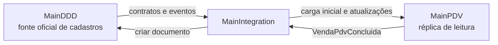
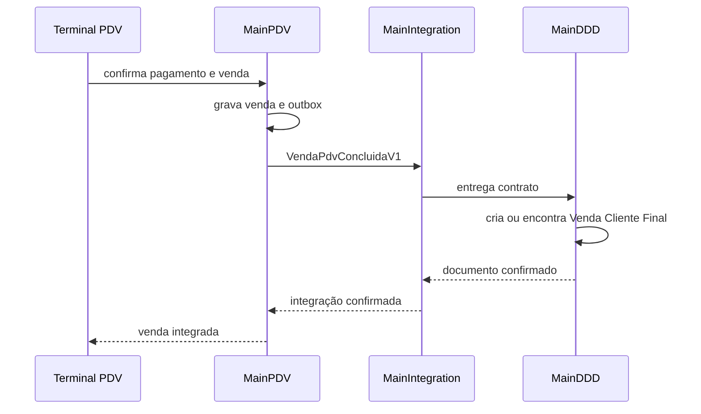

# Plano de implementação — integração MainDDD, MainIntegration e MainPDV

## Objetivo

Permitir que o MainPDV opere com banco e backend próprios, usando cadastros corporativos do MainDDD sem acessar seu banco de dados. O MainIntegration será a fronteira que versiona contratos, distribui alterações de cadastro e entrega os fatos produzidos pelo PDV.

O primeiro fluxo completo será a venda de consumidor final: a venda é concluída no terminal, permanece segura no PDV mesmo sem conexão e, quando integrada, aparece em **Documentos** no MainDDD como **Venda Cliente Final**.

## Limites de responsabilidade

| Responsabilidade | Produto proprietário |
| --- | --- |
| Empresa, estabelecimento, local, catálogo, preço e saldo | MainDDD |
| Contratos, versões, eventos, entrega e monitoramento da integração | MainIntegration |
| Terminal, caixa, pagamentos, operação presencial e parâmetros NFC-e | MainPDV |
| Documento **Venda Cliente Final** e seus efeitos corporativos | MainDDD |

O MainPDV pode manter cópias locais de leitura. Elas servem para disponibilidade e desempenho, mas não se tornam a fonte oficial dos cadastros.

## Etapa 1 — preparar os dados mestres no MainDDD

1. Criar o agregado de empresa e estabelecimento, com CNPJ, inscrição estadual, UF e endereço.
2. Vincular cada `Local` a um estabelecimento.
3. Preservar no local seus atributos operacionais, incluindo a indicação de que está habilitado para PDV.
4. Manter produto, embalagem, tabela de preço, preço vigente, tipo de saldo e associação de saldo por local como cadastros corporativos.
5. Criar o tipo de documento **Venda Cliente Final**, com regras de estoque e numeração compatíveis com a venda presencial.

### Resultado esperado

O PDV deixa de ser proprietário de CNPJ, inscrição estadual e UF. Ele referencia o estabelecimento do MainDDD e conserva somente configuração fiscal específica do terminal ou da emissão: ambiente, série, próximo número, CSC e certificado.

## Etapa 2 — definir contratos no MainIntegration

Os contratos devem ser públicos, versionados e independentes das entidades internas ou do banco de qualquer produto.

### Cadastros enviados ao PDV

| Contrato | Dados mínimos |
| --- | --- |
| `EstabelecimentoDisponivelV1` | Id, nome, CNPJ, IE, UF, status. |
| `LocalDisponivelV1` | Id, estabelecimentoId, código, nome, habilitadoParaPdv, status. |
| `TipoSaldoLocalV1` | LocalId, tipoSaldoId, código, nome, natureza e status. |
| `ProdutoComercialV1` | Produto, embalagem, código de barras, situação e versão. |
| `PrecoVigenteV1` | Tabela, produto, embalagem, valor, período de vigência e versão. |

Cada contrato terá uma chave de origem estável, versão do registro, data de alteração e identificador do tenant.

### Fatos enviados pelo PDV

| Contrato | Dados mínimos |
| --- | --- |
| `VendaPdvConcluidaV1` | Id da venda, chave de idempotência, terminal, estabelecimento, local, operador, itens, preços, descontos, pagamentos, documento fiscal e data. |
| `VendaPdvCanceladaV1` | Referência da venda original, motivo, operador, data e dados fiscais aplicáveis. |
| `VendaPdvDevolvidaV1` | Referência da venda original, itens devolvidos, motivo, operador e data. |

O contrato leva valores efetivamente praticados na venda. O MainDDD não deve recalcular um preço histórico usando a tabela atual.

## Etapa 3 — implementar sincronização de cadastros

1. O MainIntegration disponibiliza uma carga inicial paginada por tenant e tipo de cadastro.
2. O MainDDD grava a alteração do cadastro e uma mensagem de saída na mesma transação.
3. O MainIntegration publica o evento e mantém posição de entrega por consumidor.
4. O MainPDV atualiza sua projeção local de forma idempotente, usando a versão do registro.
5. Uma reconciliação periódica detecta e repara mensagens perdidas ou versões divergentes.

O PDV só libera a operação de um terminal quando a réplica tiver estabelecimento, local, saldo e catálogo compatíveis com sua configuração.

## Etapa 4 — integrar a venda do PDV ao MainDDD

1. O terminal grava venda, pagamentos, resultado fiscal e mensagem `VendaPdvConcluidaV1` na mesma transação local.
2. A venda recebe o estado `PendenteDeIntegracao`.
3. O MainIntegration entrega a mensagem ao endpoint ou consumidor do MainDDD.
4. O MainDDD encontra ou cria o documento **Venda Cliente Final** pela chave de idempotência e pela referência da venda do PDV.
5. Após criar o documento e aplicar os efeitos corporativos definidos, o MainDDD confirma a integração.
6. O MainPDV registra o identificador do documento do MainDDD e muda a venda para `Integrada`.

## Etapa 5 — falhas, segurança e auditoria

- Nenhuma indisponibilidade temporária do MainDDD bloqueia o fechamento da venda no PDV.
- Falhas permanecem na fila do PDV e podem ser reprocessadas por administrador.
- Toda mensagem possui correlação, chave de idempotência, tenant, origem e data.
- O MainIntegration autentica cada produto e valida o tenant antes da entrega.
- Mudanças de configuração fiscal, preço e estabelecimento preservam histórico e auditoria.
- Certificado e CSC nunca transitam nos eventos de cadastro; apenas referências seguras podem existir no PDV.

## Ordem de execução

1. **MainIntegration:** criar os projetos de contratos versionados, outbox, entrega, rastreabilidade e reprocessamento.
2. **MainDDD:** implementar empresa e estabelecimento, vínculo com local e contratos de leitura dos cadastros necessários ao PDV.
3. **MainPDV:** criar projeções locais para estabelecimento, local, saldo, catálogo e preço; trocar leituras diretas pelos contratos de integração.
4. **MainDDD e MainPDV:** implementar `VendaPdvConcluidaV1` e a criação idempotente de `Venda Cliente Final`.
5. **MainPDV:** exibir estado da integração e permitir reprocessamento administrativo.
6. **MainDDD e MainPDV:** implementar cancelamento e devolução com referência ao documento original.

## Critérios de aceite

- Um local habilitado no MainDDD aparece no PDV sem acesso compartilhado ao banco.
- Alteração de preço ou produto chega à réplica do PDV de forma idempotente.
- Uma venda confirmada aparece em Documentos no MainDDD como **Venda Cliente Final**.
- Reentregar a mesma venda não cria outro documento.
- O PDV continua vendendo durante indisponibilidade temporária do MainDDD e integra as pendências depois.
- Operador não pode alterar parâmetros empresariais ou fiscais; a reexecução de integrações é administrativa e auditada.
