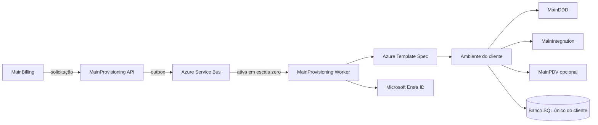

# Plano das próximas implementações do provisionamento por cliente

## Objetivo

Completar o fluxo iniciado no MainBilling para que uma contratação crie um ambiente utilizável sem intervenção manual: infraestrutura Azure, banco, aplicações contratadas, tenant, licenças, administrador inicial e convite de acesso.

## Arquitetura alvo

MainBilling e MainProvisioning são componentes centrais. Cada cliente recebe uma implantação própria, permitindo preço de hospedagem e customizações isoladas.

O banco é único por cliente. Cada backend continua proprietário de seu esquema e de suas migrações; compartilhar a instância não autoriza acesso direto às tabelas de outro produto.

MainDDD é obrigatório. MainIntegration também integra a implantação base. MainPDV e produtos futuros são condicionados pelos códigos de módulos contratados. O MainBilling não é replicado por cliente.

## Estado já concluído

- MainBilling envia solicitações autenticadas ao MainProvisioning.
- A API registra solicitações idempotentes no Azure SQL.
- O worker possui fila persistente, retomada, etapas concluídas e repetição controlada.
- Existem executores para Azure Template Spec e convite B2B pelo Microsoft Graph.
- API, worker e migrações têm pipeline por OIDC do GitHub.
- Os serviços de teste permanecem em escala mínima zero.

Ainda não existem Template Spec, permissões de implantação, permissões Microsoft Graph ou gatilho capaz de retirar o worker da escala zero.

## Ordem das implementações

### 1. Persistir resultados das etapas no MainProvisioning

Registrar por operação a chave do tenant, identificador da implantação, URLs públicas, banco criado, versão do modelo e usuário convidado. Esses resultados permitem retomada, auditoria e resposta completa ao Billing.

**Critério:** reiniciar o worker entre duas etapas não perde saídas nem repete uma ação concluída.

### 2. Criar o contrato de bootstrap do MainDDD

Adicionar uma API interna idempotente, protegida pela função `Provisioning.Bootstrap`, para criar organização, tenant, administrador inicial e licenças. O usuário é referenciado pelo identificador do Entra ID e pelo e-mail principal.

**Critério:** repetir o mesmo `ProvisioningId` devolve o tenant existente e o seletor mostra somente os módulos licenciados.

### 3. Criar os contratos de bootstrap do MainIntegration e MainPDV

MainIntegration recebe tenant, rotas internas, módulos ativos e identificadores das fontes. MainPDV recebe somente sua identidade, licença, URLs de integração e parâmetros necessários para consultar os cadastros do MainDDD; não cria os cadastros mestres.

**Critério:** os serviços iniciam configurados sem edição manual e o PDV continua sem operações de escrita sobre entidades mestres.

### 4. Criar o repositório MainInfrastructure

Manter Bicep e versões de Azure Template Spec fora do código do MainProvisioning. O modelo inicial deve criar, no ambiente do cliente:

- banco Azure SQL único;
- identidades gerenciadas de runtime;
- MainDDD Web e API;
- MainIntegration API e worker;
- MainPDV Web e API quando `PDV` estiver contratado;
- segredos por referência ao Key Vault;
- rede, ingressos, escala e tags de custo;
- saídas com todas as URLs e identificadores necessários ao bootstrap.

**Critério:** publicar uma nova versão do Template Spec e implantá-la duas vezes produz o mesmo conjunto de recursos sem duplicação.

### 5. Adicionar outbox e Azure Service Bus ao MainProvisioning

A API grava a solicitação e a mensagem de ativação na mesma transação SQL. Um publicador envia a mensagem ao Service Bus. O worker usa identidade gerenciada e escala por tamanho da fila, podendo permanecer em zero quando não houver trabalho.

**Critério:** uma falha entre banco e fila não perde a solicitação, mensagens repetidas não duplicam ambiente e a chegada de uma mensagem ativa o worker.

### 6. Conceder permissões mínimas

Criar uma identidade exclusiva para o worker. Ela recebe leitura do Template Spec, ações de implantação somente no escopo destinado aos clientes, `Azure Service Bus Data Receiver` na fila e acesso apenas aos segredos necessários. No Microsoft Graph, conceder consentimento administrativo para `User.Read.All` e `User.Invite.All`.

**Critério:** o worker consegue executar o fluxo e não consegue modificar recursos centrais fora do escopo autorizado.

### 7. Completar o fluxo do administrador inicial

Após a infraestrutura estar saudável, consultar ou convidar o usuário, executar o bootstrap do MainDDD e registrar a entrega. O convite aponta para o MainDDD recém-criado. Uma retomada consulta o usuário antes de reenviar o convite.

**Critério:** o administrador recebe uma única mensagem, entra com a conta informada e acessa o tenant correto.

### 8. Completar o acompanhamento no MainBilling

Mostrar as etapas reais da operação, falhas compreensíveis, opção de nova tentativa quando permitida e o botão de acesso somente após a conclusão. O Billing não recebe permissões para criar recursos.

**Critério:** o comprador acompanha do cadastro até o primeiro acesso sem conhecer nomes técnicos de recursos Azure.

### 9. Validar o tenant de demonstração

Usar a implantação atual como primeiro ambiente controlado. Executar contratação com MainDDD e PDV, validar login, cartão do PDV, cadastros mestres, sincronização pelo MainIntegration e isolamento do banco.

**Critério:** o fluxo completo pode ser repetido a partir de uma assinatura no Billing e todas as evidências ficam registradas.

## Sequência de PRs

| Ordem | Repositório | Entrega |
| --- | --- | --- |
| 1 | MainProvisioning | Resultados persistidos e contrato de saída. |
| 2 | MainDDD | Bootstrap idempotente de tenant, usuário e licenças. |
| 3 | MainIntegration | Bootstrap de rotas e módulos. |
| 4 | MainPDV | Bootstrap de identidade, licença e integração. |
| 5 | MainInfrastructure | Bicep, Template Spec e pipeline de versões. |
| 6 | MainProvisioning | Outbox, Service Bus, acionamento e consumo. |
| 7 | MainProvisioning | Coordenação completa Azure, Entra e bootstraps. |
| 8 | MainBilling | Progresso, falhas e acesso ao ambiente criado. |
| 9 | Todos | Teste integrado e publicação do tenant de demonstração. |

Cada PR deve manter o sistema compilável. A ativação do worker acontece somente na PR 7, quando infraestrutura, permissões e APIs de bootstrap já estiverem disponíveis.

## Decisões de custo

- Escala mínima zero para portais, APIs e workers compatíveis.
- Service Bus compartilhado pelo plano de controle, com uma fila de provisionamento.
- Um banco por cliente, com capacidade adequada ao contrato e pausa automática quando suportada.
- Tags com tenant, produto, ambiente e operação de origem em todos os recursos.
- A versão do Template Spec e os identificadores das imagens ficam registrados na operação para permitir suporte e reprodução.
