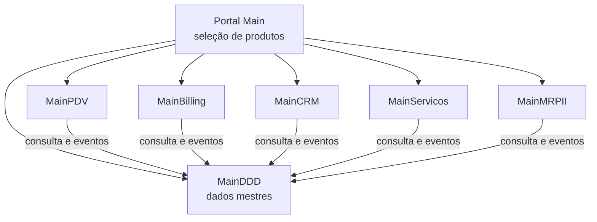
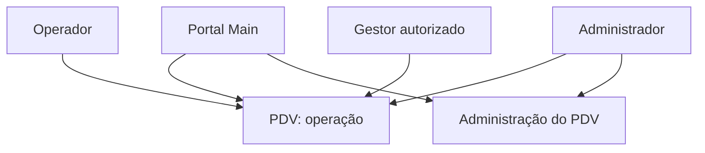

# Plataforma de produtos dependentes do MainDDD

## Objetivo

Esta proposta organiza a plataforma em produtos licenciáveis e backends independentes, mantendo o MainDDD como a fonte oficial dos cadastros operacionais compartilhados.

O objetivo não é transformar o MainDDD em um detalhe técnico comum a todos. Ele permanece um produto central, com responsabilidades próprias. PDV, Billing, CRM, Serviços e MRP II são produtos especializados que dependem desses cadastros para operar.

Esta é uma direção arquitetural proposta. A modularização interna do MainDDD já existe, mas a separação dos produtos em backends e bancos independentes ainda precisa ser implementada.

## Visão da plataforma



Cada produto possui seu backend, banco, migrations, versão, publicação e licença próprios. A dependência com MainDDD é uma dependência de negócio e integração: os produtos usam os cadastros que ele possui, sem acessar seu banco ou suas implementações internas.

## MainDDD como fonte oficial dos dados mestres

MainDDD é o sistema de registro oficial para dados comuns à operação.

| Dados sob responsabilidade do MainDDD | Uso nos produtos especializados |
| --- | --- |
| Pessoas e empresas | Clientes de vendas, cobranças, ordens de serviço e relacionamento. |
| Produtos, categorias e embalagens | Itens vendidos, cobrados, produzidos ou usados em serviços. |
| Tabelas de preço | Precificação comercial quando aplicável. |
| Locais, tipos de saldo e estoque | Disponibilidade, reserva, consumo e movimentação. |
| Tipos e documentos operacionais | Base documental compartilhada quando a regra do domínio exigir. |

Os demais produtos mantêm apenas os identificadores desses registros e seus próprios dados.

```text
Ordem de Serviço
├── Id                       → MainServicos
├── PessoaId                 → MainDDD
├── ProdutoId                → MainDDD
├── TecnicoId                → MainServicos
├── Agenda e execução        → MainServicos
└── Peças aplicadas          → MainServicos, referenciando produtos do MainDDD
```

Um produto pode manter uma projeção local de leitura com nome do cliente, código do produto ou saldo disponível quando precisar de desempenho, disponibilidade parcial ou consultas próprias. Essa projeção não se torna a fonte oficial do cadastro; ela é atualizada por contratos e eventos publicados pelo MainDDD.

## Produtos especializados

| Produto | Responsabilidade própria | Dependências principais do MainDDD |
| --- | --- | --- |
| MainPDV | Caixa, venda presencial, pagamentos, fechamento e emissão fiscal. | Cliente, produto, preço, local e estoque. |
| MainBilling | Títulos, cobrança, contas a receber, regras de faturamento e integração financeira. | Pessoa, produtos/serviços, preço e documentos de origem. |
| MainCRM | Leads, oportunidades, contatos, campanhas e histórico comercial. | Pessoa ou empresa convertida em cliente. |
| MainServicos | Ordens de serviço, agenda, técnicos, execução e peças. | Cliente, produtos, preços e estoque. |
| MainMRPII | Planejamento de materiais, estrutura de produto, ordens de produção, capacidade e consumo. | Produtos, embalagens, locais e estoque. |

MRP II significa *Manufacturing Resource Planning*. Ele possui regras próprias de planejamento e produção; MainDDD fornece a referência oficial a materiais e posições de estoque, mas não deve absorver as regras de capacidade, roteiro ou ordem de produção.

## Administração separada do PDV

O produto MainPDV terá duas áreas distintas, com navegação e permissões próprias.

| Área | Público | Responsabilidades |
| --- | --- | --- |
| Operação de PDV | Operadores e gestores autorizados. | Abrir e fechar caixa, registrar vendas, pagamentos, cancelamentos permitidos e emissão fiscal operacional. |
| Administração do PDV | Somente usuários com perfil administrador. | Configuração empresarial, fiscal, terminais, caixas, meios de pagamento, séries, regras e parâmetros operacionais. |

A entrada principal do PDV deve abrir diretamente a operação. Menus de configuração fiscal e empresarial não fazem parte do menu operacional, nem devem aparecer para operadores. A administração terá rota e página próprias, por exemplo `/pdv/administracao`, podendo ser oferecida como uma entrada administrativa separada no portal para quem tiver a permissão adequada.



A ocultação no frontend serve apenas para simplificar a experiência. O backend do MainPDV aplica a política `Pdv.Administracao.Gerenciar` em toda API administrativa. Essa permissão é concedida aos papéis `Proprietário` e `Administrador`; gestores e operadores não a recebem por padrão.

Mudanças fiscais e empresariais precisam de auditoria: usuário responsável, data, valores anterior e posterior, correlação da alteração e, quando aplicável, período de vigência. A configuração efetiva usada em uma venda ou documento fiscal deve ficar registrada para preservar rastreabilidade, mesmo após alterações posteriores.

## Regras de integração

Os produtos não acessam `DbContext`, repositórios, tabelas nem DLLs de domínio ou infraestrutura de outro backend. A integração deve acontecer pelos contratos públicos do produto proprietário.

| Necessidade | Mecanismo recomendado |
| --- | --- |
| Consulta imediata de cadastro, preço ou saldo | API pública do MainDDD. |
| Propagação de mudança de cadastro | Evento publicado pelo MainDDD e projeção local do consumidor. |
| Venda concluída no PDV | Evento do PDV; MainDDD processa a operação de estoque conforme o contrato definido. |
| Faturamento originado de uma venda ou serviço | Evento do produto de origem consumido pelo Billing. |
| Histórico de relacionamento | Evento de venda, cobrança ou serviço consumido pelo CRM. |
| Alteração de cadastro mestre | Command/API do MainDDD, submetido à sua regra de autorização. |

Uma mesma operação não deve tentar gravar bancos de dois produtos dentro de uma única transação distribuída. Cada produto grava sua própria transação e publica eventos com idempotência. Quando uma sequência falhar, o produto responsável registra a pendência e permite nova tentativa ou compensação conforme a regra de negócio.

## Contratos públicos do MainDDD

Para que outros produtos dependam do MainDDD sem acoplamento à implementação, ele deve oferecer uma fronteira de integração estável.

```text
MainDDD.Integration.Contracts
├── Pessoas
│   ├── PessoaResumo
│   ├── PessoaCriada
│   └── PessoaAtualizada
├── Catalogo
│   ├── ProdutoResumo
│   ├── ProdutoAtualizado
│   └── EmbalagemAtualizada
├── Precificacao
│   ├── ConsultaPreco
│   └── PrecoAlterado
├── Estoque
│   ├── ConsultaSaldo
│   └── SaldoAlterado
└── Documentos
    └── eventos operacionais publicados
```

Esses contratos podem ser distribuídos como pacote versionado para bibliotecas .NET e também representados por OpenAPI e esquemas de eventos para outros consumidores. A mudança de um contrato deve ser compatível ou introduzir uma nova versão; produtos já licenciados não devem quebrar por uma alteração interna do MainDDD.

## Licenciamento e portal

O portal é responsável por apresentar as áreas disponíveis ao usuário. A decisão de licenciamento deve ser centralizada em um catálogo de produtos por tenant.

```text
Tenant A
├── MainDDD Base      obrigatório, ativo
├── MainPDV           ativo
├── MainBilling       ativo
├── MainCRM           ativo
├── MainServicos      inativo
└── MainMRPII         ativo
```

O portal lista somente os produtos habilitados para o tenant e para as permissões do usuário. No MainDDD, o seletor pós-login mantém as áreas do **MainDDD Base** — cadastros e documentos — e consulta `GET /api/identidade-acesso/modulos` para acrescentar os produtos especializados licenciados. A licença tem período de vigência e endereço de acesso; o cartão do PDV só aparece com uma licença ativa e abre o MainPDV.

Cada backend também valida a licença e o tenant em suas próprias APIs. Ocultar o cartão no portal melhora a experiência, mas não é controle de acesso suficiente.

Cada produto declara seus pré-requisitos. Neste desenho, todos os produtos especializados exigem `MainDDD Base` ativo. Um produto pode ter recursos internos adicionais, como emissão fiscal no PDV ou planejamento avançado no MRP II, licenciados como capacidades do próprio produto.

## Estrutura sugerida por produto

Cada backend mantém sua solução e repositório próprios, seguindo internamente o padrão modular já aplicado ao MainDDD.

```text
MainServicos/
├── src/
│   ├── Modules/
│   │   ├── OrdensServico/
│   │   ├── Agenda/
│   │   └── Tecnicos/
│   ├── Integration/
│   │   └── MainDDD/
│   └── MainServicos.API/
├── Tests/
└── MainServicos.sln
```

`Integration/MainDDD` contém clientes de API, consumidores de eventos, projeções locais e adaptadores dos contratos públicos. As regras de ordens de serviço permanecem nos módulos de MainServicos; não devem ser colocadas no MainDDD apenas porque consultam produtos ou pessoas.

## Ordem de implementação

1. Criar o catálogo de produtos, licenças e permissões que alimentará o portal.
2. Definir a API e os eventos públicos do MainDDD para pessoas, catálogo, preços e estoque.
3. Separar o portal da seleção fixa de “Requisições” e “Manutenção”, permitindo registrar produtos licenciados.
4. Implementar o primeiro produto especializado com sua integração ao MainDDD.
5. Repetir o padrão para os próximos produtos, versionando contratos e medindo dependências reais.

CRM ou Serviços são bons primeiros candidatos: possuem valor próprio e usam pessoas, produtos e preços sem exigir a coordenação imediata entre PDV, faturamento e estoque. PDV, Billing e MRP II podem seguir quando os contratos de estoque, documento e preço estiverem estabilizados.

## Critério de sucesso

A plataforma estará consistente com este modelo quando um tenant puder contratar e acessar um produto especializado sem precisar instalar o código dos demais produtos, mantendo MainDDD Base como fonte dos cadastros comuns. O produto especializado deverá operar com seu próprio banco e deployment, usando somente APIs, eventos e contratos públicos do MainDDD.
