# Caminho de sucesso para deploy Azure e integração GitHub

Este documento formaliza o processo que leva uma alteração aprovada no código até uma aplicação publicada, monitorada e reversível no Azure. Ele vale para MainBilling, MainDDD, MainPDV e MainIntegration.

## Arquitetura de destino

Cada produto tem pacotes independentes. Portais públicos recebem usuários; APIs executam regras e dados; workers executam tarefas internas sem endereço público.

| Produto | Componentes |
| --- | --- |
| MainBilling | portal e API |
| MainDDD | portal e API |
| MainPDV | portal e API |
| MainIntegration | API e worker interno |

O banco SQL permanece privado. Portais não acessam o banco: chamam suas APIs por HTTPS. APIs e workers acessam o banco pela rede privada.

## Pré-requisitos Azure

1. Assinatura Azure ativa e grupo de recursos do ambiente, por exemplo `rg-mainsyst-teste`.
2. Orçamento com alertas em 50%, 70% e 85% do crédito ou limite mensal.
3. Registro dos provedores `Microsoft.App`, `Microsoft.ContainerRegistry`, `Microsoft.Sql`, `Microsoft.Network` e `Microsoft.OperationalInsights`.
4. Key Vault para segredos de banco e integrações.
5. Azure Container Registry para imagens privadas.
6. Ambiente Azure Container Apps integrado a uma rede virtual.
7. Azure SQL Database serverless com pausa automática e limite gratuito quando disponível.

## Rede privada

A rede do ambiente precisa de:

1. Uma rede virtual dedicada.
2. Uma sub-rede delegada a `Microsoft.App/environments` para Container Apps.
3. Uma sub-rede exclusiva para endpoints privados.
4. Um endpoint privado ligado ao servidor Azure SQL.
5. A zona DNS privada `privatelink.database.windows.net`, vinculada à rede virtual.
6. Desativação do acesso público do Azure SQL somente depois que a migração inicial estiver disponível pela rede privada.

A API deve ter entrada interna. O portal permanece público e chama a API pela URL interna. O worker não tem entrada pública.

## Identidades e permissões

Usar uma identidade gerenciada dedicada à implantação e às aplicações. As permissões mínimas são:

| Identidade | Escopo | Permissão |
| --- | --- | --- |
| Identidade de runtime | Registro de imagens | `AcrPull` |
| Identidade de runtime | Key Vault | leitura apenas dos segredos necessários |
| Identidade de implantação | Grupo de recursos de teste | `Contributor` apenas no grupo |
| Identidade de implantação | Registro de imagens | `AcrPush` |

A senha do SQL e a cadeia de conexão devem ser criadas uma única vez e mantidas no Key Vault. Nenhum segredo entra em arquivo de configuração, commit, variável visível ou log de pipeline.

## Requisitos GitHub

Cada repositório publicável precisa ter:

1. Arquivo de contêiner para cada projeto executável.
2. Workflow em `.github/workflows` acionado pelo merge na branch de entrega e manualmente quando necessário.
3. Permissões `contents: read` e `id-token: write` no workflow.
4. Ambiente GitHub chamado `teste` para separar a publicação de demonstração.
5. Identidade federada no Azure com o assunto `repo:JAyres88/NOME_DO_REPOSITORIO:environment:teste`.
6. Variáveis de repositório, sem segredos:
   - `AZURE_CLIENT_ID`
   - `AZURE_TENANT_ID`
   - `AZURE_SUBSCRIPTION_ID`
   - `AZURE_ACR_NAME`
   - nomes das aplicações de contêiner do produto.
7. Segredos somente no Key Vault ou, quando inevitável, em GitHub Secrets.

A autenticação do pipeline é por OpenID Connect entre GitHub e Azure. Não usar senha, chave de publicação nem credencial de longa duração.

## Primeiro deploy

A primeira publicação segue esta ordem:

1. Criar rede privada, registro de imagens, Key Vault, Azure SQL e ambiente Container Apps.
2. Criar o endpoint privado e validar a resolução DNS interna do SQL.
3. Criar um Container Apps Job de migração, conectado à mesma rede privada.
4. Construir e publicar a imagem da API no registro privado.
5. Executar o job de migração para aplicar o esquema do banco.
6. Criar a API interna com a imagem publicada, identidade de runtime e segredos por referência.
7. Testar a saúde da API a partir do ambiente privado.
8. Construir e publicar a imagem do portal.
9. Criar o portal público, configurado com a URL interna da API.
10. Validar página inicial, autenticação, dados básicos e uma operação de leitura e escrita.
11. Desativar o acesso público do Azure SQL.
12. Registrar os endereços públicos no Billing e nos redirecionamentos Entra ID.

## Atualização normal

Depois da primeira publicação, cada alteração segue este fluxo:

```mermaid
flowchart LR
    A[PR aprovada] --> B[Merge na branch de entrega]
    B --> C[GitHub obtém token OIDC]
    C --> D[Constrói imagem com identificador do commit]
    D --> E[Publica no registro privado]
    E --> F[Executa migração, se houver]
    F --> G[Atualiza API]
    G --> H[Valida revisão saudável]
    H --> I[Atualiza portal]
    I --> J[Teste público e registro da versão]
```

A imagem recebe o identificador do commit. A atualização de API ocorre antes do portal para evitar que a interface nova chame contratos ainda indisponíveis.

## Critérios de sucesso

A entrega só é concluída quando:

- O workflow termina sem falhas.
- A nova revisão da API está saudável.
- O portal retorna HTTP 200 por HTTPS.
- Login e navegação para o módulo licenciado funcionam.
- A API acessa o banco somente pela rede privada.
- O Azure SQL não aceita acesso pela rede pública.
- O orçamento e os alertas estão ativos.
- A versão anterior pode ser restaurada pela imagem identificada pelo commit.

## Retorno a uma versão anterior

1. Identificar o último commit saudável.
2. Atualizar API e portal para as imagens daquele commit.
3. Não desfazer uma migração de banco automaticamente; aplicar uma migração corretiva quando necessário.
4. Registrar o incidente e o motivo do retorno.

## Situação do ambiente de teste

O ambiente `rg-mainsyst-teste` já possui identidade gerenciada, Key Vault, orçamento, Container Registry, ambiente Container Apps, API e portal iniciais do MainDDD. A implantação final segue este documento para mover as aplicações ao ambiente privado e conectar o banco sem regra de rede ampla.
